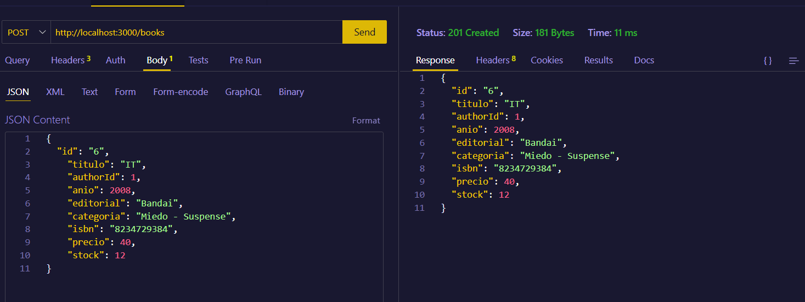
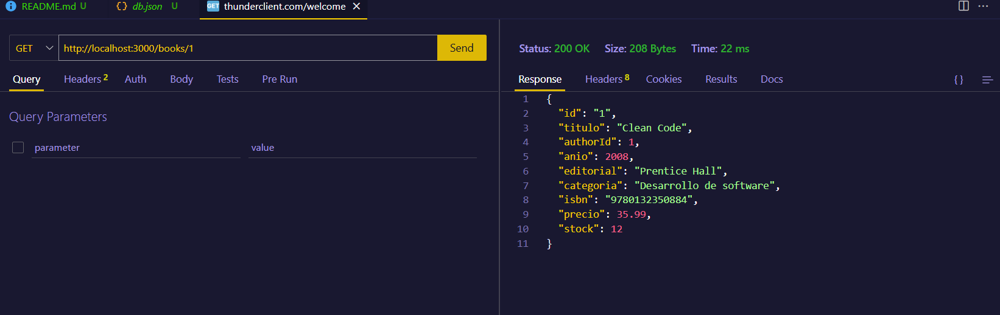
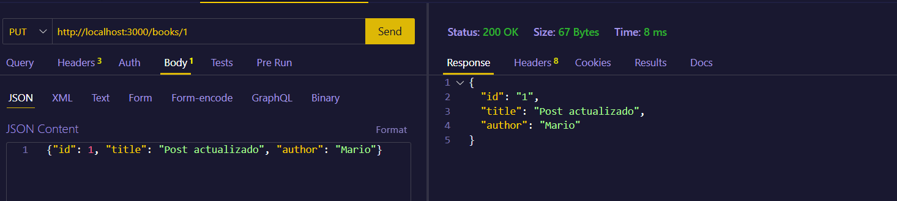
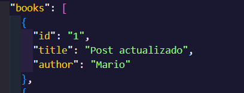
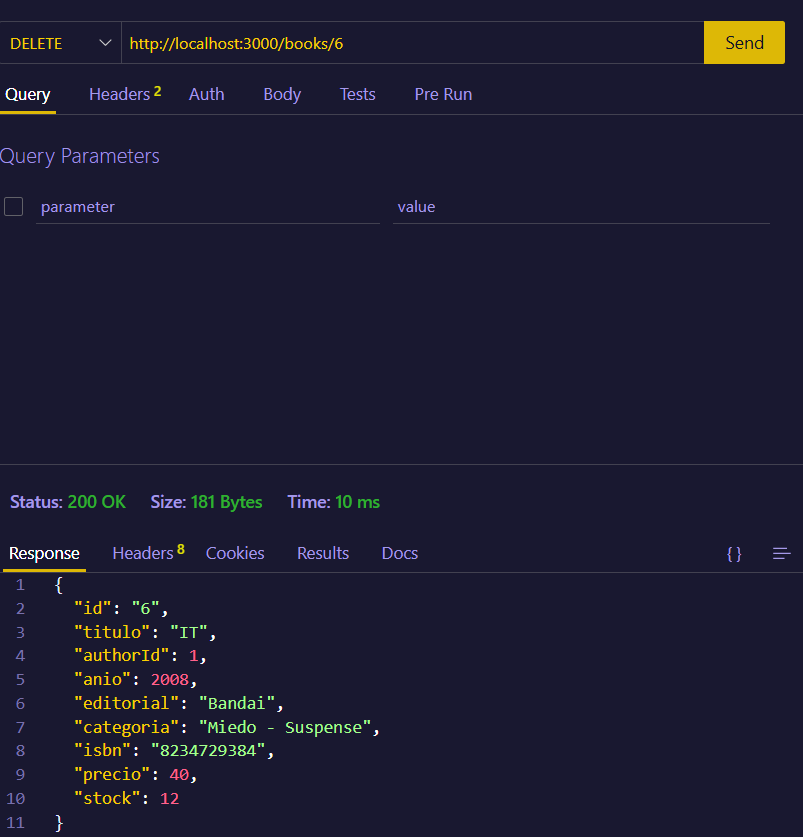
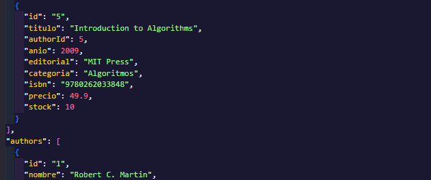

# Tarea CURL 
### POST
Con la operación POST lo que estamos haciendo es insertar un nuevo recurso

### GET
Con la operación GET obtenemos un dato de la base de datos

### PUT
Con la operación PUT actualizamos un dato de la base de datos

Comprobación

### DELETE
Con la operación DELETE borramos un dato de la base de datos

Comprobación

Podemos ver que nuestro último registro de los libros es el 5 y después salta a los autores, por lo que se ha eliminado el libro con el ID 6

