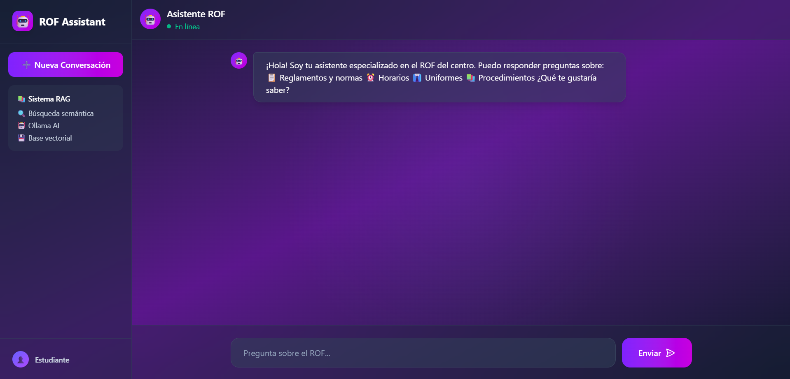
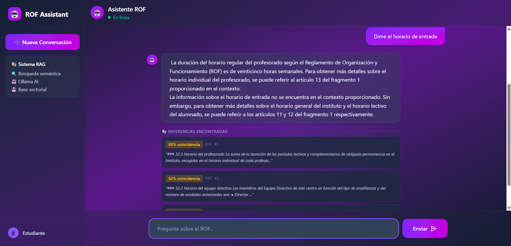

# Chatbot RAG con Embeddings 🤖

Aplicación full-stack que implementa un sistema RAG (Retrieval Augmented Generation) especializado en consultas sobre el Reglamento de Organización y Funcionamiento (ROF) del centro educativo. Procesa documentos grandes, genera representaciones vectoriales y permite búsquedas semánticas inteligentes.

**Proyecto:** chatbot-rag-AM-MV-AC  
**Curso:** Desarrollo Web en entorno Cliente - 2º DAW  
**Centro:** IES HLanz

## 🚀 Características

- **Procesamiento inteligente de documentos**: División automática del ROF en fragmentos semánticamente coherentes
- **Generación de embeddings**: Vectorización de texto usando Ollama con modelo nomic-embed-text
- **Base de datos vectorial**: Almacenamiento persistente en SQLite3 para búsquedas rápidas
- **Búsqueda semántica**: Sistema de similitud de coseno para encontrar información relevante
- **Arquitectura modular**: Scripts reutilizables para cada fase del proceso
- **Dockerización completa**: Servicios orquestados con Docker Compose
- **Pipeline automatizado**: Comando único para ejecutar todo el flujo de ingesta

## 💻 Tecnologías

- **Backend:** Node.js (ES Modules), Express
- **Base de datos:** SQLite3 (better-sqlite3)
- **IA:** Ollama (nomic-embed-text, mistral)
- **Frontend:** HTML5, CSS3, JavaScript vanilla
- **Containerización:** Docker, Docker Compose
- **Testing:** Jest

## 📁 Estructura del Proyecto

```
chatbot-rag-AM-MV-AC/
├── backend/
│   ├── datos/
│   │   ├── .gitkeep
│   │   ├── chunks.json          # Fragmentos procesados
│   │   ├── embeddings.json      # Fragmentos con vectores
│   │   ├── rof_vectores.db      # Base de datos SQLite
│   │   └── rof.txt              # ROF original (entrada)
│   ├── scripts/
│   │   ├── cargar_bd.js             # Fase 3: Carga a base de datos
│   │   ├── generar_embeddings.js    # Fase 2: Generación de vectores
│   │   ├── procesar_rof.js          # Fase 1: División en fragmentos
│   │   └── test_busqueda.js         # Fase 4: Pruebas de búsqueda
│   ├── tests/
│   │   ├── generar_embedding.test.js 
│   │   ├── procesar_rof.test.js
│       └── test_busqueda.test.js
├── docs/
│   ├── checklist.md 
├── frontend/
├── .env
├── .env.example
├── .gitignore
├── docker-compose.yml           # Orquestación de servicios
├── package-lock.json
├── package.json
├── README.md
├── server.js                    # Servidor Express principal
└── validacion.http              # Tests HTTP con REST Client
```

## 🛠️ Instalación

### Requisitos previos

- Node.js v20+ y npm 10+
- Docker 24+ y Docker Compose V2
- Ollama instalado localmente
- Git

### Pasos de instalación

1. **Clona el repositorio**
   ```bash
   git clone --no-checkout git@github.com:MarioValiente-Giraldo/agentes_ia_25_26.git
   cd chatbot-rag-AM-MV-AC
   git sparse-checkout init --cone
   git sparse-checkout set chatbot-rag-AM-MV-AC
   git checkout
   ```

2. **Instala las dependencias**
   ```bash
   npm install
   ```

3. **Configura las variables de entorno**
   - Copia el archivo `.env.example` a `.env`
   ```bash
   cp .env.example .env
   ```
   - Ajusta las variables según tu configuración:
   ```env
   # Ollama
   OLLAMA_URL=http://localhost:11434
   OLLAMA_MODEL_EMBEDDINGS=nomic-embed-text
   OLLAMA_MODEL_LLM=mistral
   
   # Base de datos
   DB_PATH=./backend/datos/rof_vectores.db
   CHUNKS_PATH=./backend/datos/chunks.json
   OUTPUT_PATH=./backend/datos/embeddings.json
   JSON_PATH=./backend/datos/embeddings.json
   
   # Node
   NODE_ENV=development
   ```

4. **Inicia Ollama con Docker**
   ```bash
   docker compose up -d
   ```

5. **Descarga los modelos de IA**
   ```bash
   docker exec ollama_rag ollama pull nomic-embed-text
   docker exec ollama_rag ollama pull mistral
   ```

6. **Añade tu archivo ROF**
   - Coloca el archivo `rof.txt` en la carpeta `backend/datos/`
   - Asegúrate de que tenga al menos 5000 caracteres

## 🎯 Uso

### Pipeline completo de ingesta

Ejecuta todo el proceso de ingesta con un solo comando:

```bash
npm run ingesta
```

Este comando ejecuta en orden:
1. Procesamiento del ROF (trocear en fragmentos)
2. Generación de embeddings
3. Carga a base de datos

### Scripts individuales

#### 1. Procesar ROF
```bash
npm run procesar
```
Lee el ROF desde `backend/datos/`, lo divide en fragmentos coherentes y guarda el resultado en `backend/datos/chunks.json`.

**Salida esperada:**
```
✅ ROF procesado exitosamente
📊 Fragmentos generados: 87
📏 Tamaño promedio: 342 caracteres
📄 Primer fragmento: "El Reglamento de Organización..."
⚠️ Fragmentos descartados: 5 (muy pequeños)
```

#### 2. Generar embeddings
```bash
npm run embeddings
```
Genera vectores numéricos para cada fragmento usando Ollama.

**Salida esperada:**
```
🔄 Conectando a Ollama en http://localhost:11434...
✅ Ollama disponible
📝 Cargados 87 fragmentos de backend/datos/chunks.json
Generando embeddings:
[████████████████████] 87/87 100%
✅ Embeddings generados exitosamente
⏱ Tiempo: 156 segundos
💾 Guardados en backend/datos/embeddings.json
📊 Dimensión de cada embedding: 768
```

#### 3. Cargar a base de datos
```bash
npm run cargar-bd
```
Almacena los embeddings en una base de datos SQLite3.

**Salida esperada:**
```
🗄 Inicializando base de datos...
✅ Tabla 'fragmentos' creada
📥 Insertando 87 fragmentos...
[████████████████████] 87/87 100%
✅ Base de datos cargada exitosamente
📊 Fragmentos en BD: 87
💾 Tamaño de archivo: 3.2 MB
✅ Integridad verificada
```

#### 4. Probar búsqueda semántica
```bash
npm run test-busqueda
```
Realiza búsquedas de prueba para validar el sistema.

**Salida esperada:**
```
🔍 Buscando fragmentos similares a: "¿Cuál es el horario de entrada?"
📍 Resultados (similitud):
1. [0.87] "El horario de entrada es de 08:00 a 08:30..."
2. [0.72] "Los estudiantes deben llegar puntualmente..."
3. [0.65] "El retraso se justifica solamente en caso de..."
```

### Modo desarrollo
```bash
npm run dev
```
Ejecuta `test_busqueda.js` con auto-recarga al detectar cambios.

## 🧪 Testing

Ejecuta los tests con:
```bash
npm test
```

Los tests cubren:
- Procesamiento correcto de fragmentos
- Generación válida de embeddings
- Carga exitosa en base de datos
- Búsquedas semánticas funcionales

## 🔍 ¿Qué es RAG?

**RAG (Retrieval Augmented Generation)** es una técnica que combina:

1. **Retrieval (Recuperación)**: Busca información relevante en una base de datos
2. **Augmented (Aumentada)**: Enriquece el contexto del modelo de IA
3. **Generation (Generación)**: Genera respuestas basadas en datos reales

### ¿Qué es un embedding?

Un **embedding** es una representación vectorial de texto que:
- Convierte palabras/frases en números (vectores de ~768 dimensiones)
- Textos con significado similar tienen vectores cercanos
- Permite búsquedas semánticas usando similitud de coseno

**Ejemplo:**
```
"horario de entrada" → [0.23, -0.45, 0.67, ..., 0.12]
"hora de llegada"    → [0.25, -0.43, 0.65, ..., 0.14]
                          ↓ similitud alta (vectores cercanos)
```

## 📊 Estructura de Datos

### chunks.json
```json
[
  {
    "id": 1,
    "contenido": "El Reglamento de Organización...",
    "fuente": "rof.txt",
    "pagina": null
  }
]
```

### embeddings.json
```json
[
  {
    "id": 1,
    "embedding": [0.23, -0.45, 0.67, ..., 0.12]
  }
]
```

### Tabla `fragmentos` en BD
```sql
CREATE TABLE fragmentos (
    id INTEGER PRIMARY KEY,
    contenido TEXT NOT NULL,
    embedding TEXT NOT NULL,  -- JSON stringificado
    fuente TEXT,
    pagina INTEGER,
    creado_en TIMESTAMP DEFAULT CURRENT_TIMESTAMP
)
```

## 🐳 Docker

### Levantar servicios
```bash
docker compose up -d
```

### Verificar Ollama
```bash
curl http://localhost:11434/api/tags
```

### Detener servicios
```bash
docker compose down
```

## 🎨 Decisiones de Diseño

### ¿Por qué SQLite3?
- Ligero y sin necesidad de servidor
- Ideal para aplicaciones locales
- Excelente rendimiento para vectores

### ¿Por qué nomic-embed-text?
- Modelo optimizado para embeddings de texto
- Tamaño razonable (~274MB)
- Buena calidad de vectorización

### Tamaño mínimo de fragmentos (100 caracteres)
- Evita fragmentos sin contexto suficiente
- Mejora la calidad de las búsquedas
- Reduce ruido en la base de datos

## 📸 Capturas de Pantalla




## 🤝 Trabajo en Equipo

Este proyecto fue desarrollado en grupo:
Se pueden comprobar las tareas de cada uno en el cheklist


## 👨‍💻 Autores

**[Nombres de los estudiantes]**
- GitHub: [@MarioValiente-Giraldo](https://github.com/MarioValiente-Giraldo)
- GitHub: [@Amolnav](https://github.com/Amolnav)
- GitHub: [@Adamcum](https://github.com/Adamcum)
- GitHub: [@claudiasolera](https://github.com/claudiasolera)


## 📝 Licencia
Este proyecto es parte del curso de Desarrollo Web en entorno Cliente - 2º DAW en IES HLanz.

## 🙏 Agradecimientos

- Profesor Isaías FL por la guía y especificaciones del proyecto
- IES HLanz por proporcionar el ROF
