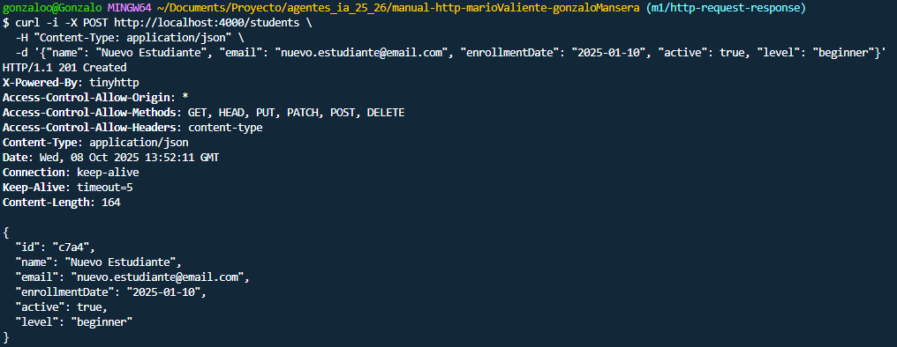
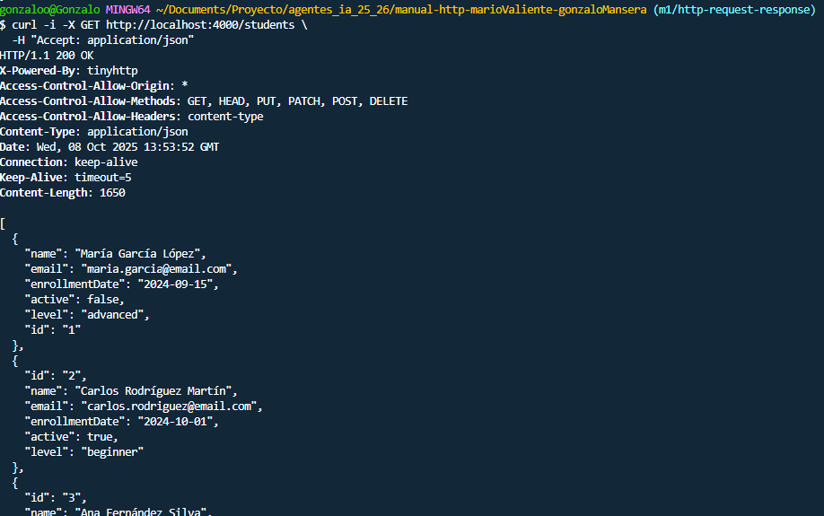
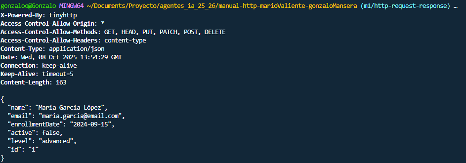
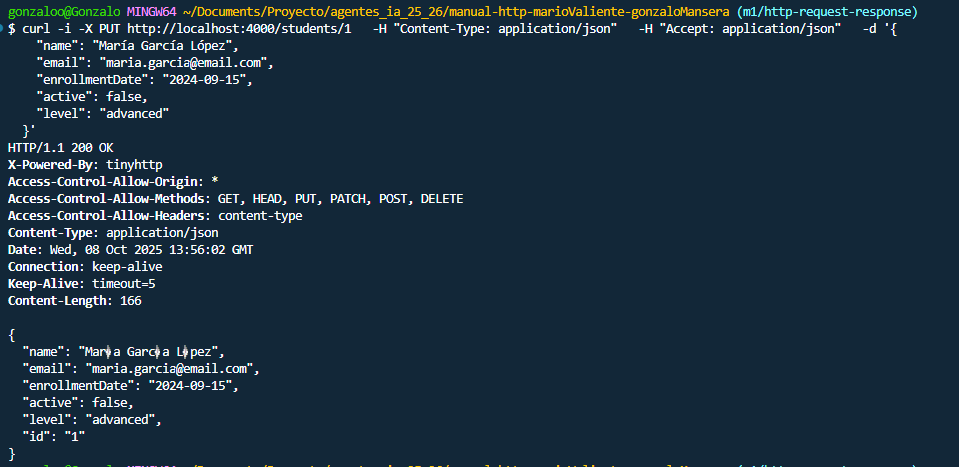
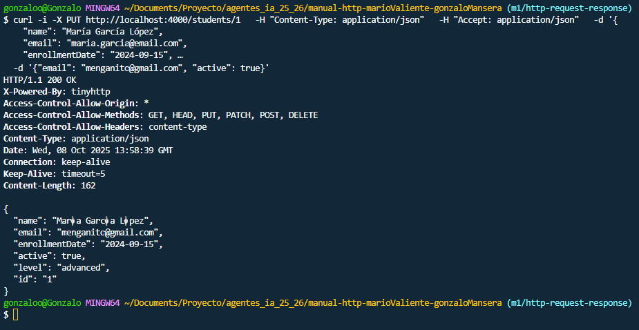
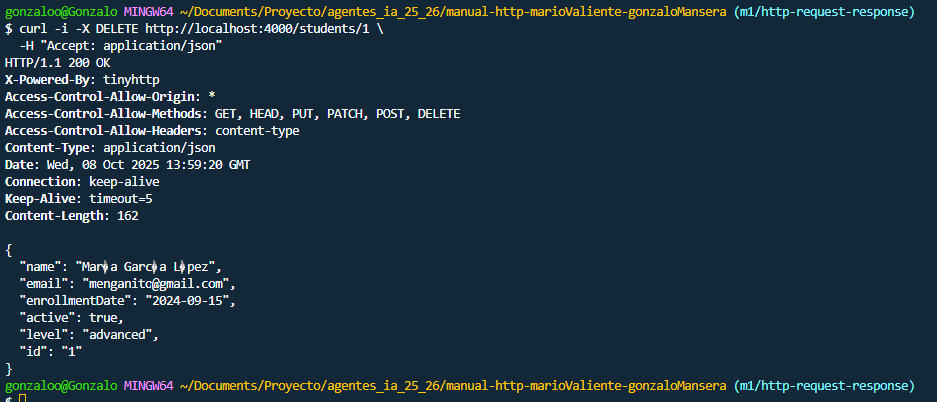

# Documentación CRUD con CURL- API REST
## ÍNDICE 
### 1. CREATE - Crear un recurso nuevo.
### 2. READ ALL - Obtener todos los recursos.
### 3. READY BY ID - Obtener un recurso específico.
### 4. UPDATE - Actualizar todo el recurso. 
### 5. PATCH - Actualizar parte del recurso.
### 6. DELETE - Eliminar recurso.
#
## 1. CREATE- Crear un nuevo recurso.
### Titulo
Crear un nuevo recurso en la base de datos. 
### Descripción
Con el comando CREATE podemos agregar un recurso nuevo a la base de datos mediante el envío de datos en formato JSON. Una vez realizado el servidor procesa esta información y le asigna un ID único automáticamente.

### Ejemplo comando CURL 
```bash
curl -i -X POST http://localhost:4000/students \
  -H "Content-Type: application/json" \
  -d '{"name": "Nuevo Estudiante", "email": "nuevo.estudiante@email.com", "enrollmentDate": "2025-01-10", "active": true, "level": "beginner"}'
```
"id": 2,
        "studentId": 2,
        "courseId": 2,
        "enrollmentDate": "2024-10-01",
        "progress": 20,
        "completed": false
### Explicación detallada 
curl ===> Herramienta de línea de comandos para transferirdatos con URLs.

-i ===>  Incluye los headers HTTP en la salida, permitiendo ver el código de estado y metadatos de la respuesta.

-X POST ===> Especifica el método HTTP POST para crear un nuevo recurso.

http://localhost:4000/students ===> URL del endpoint donde se enviará la petición.

-H "Content-Type: application/json" ===> Header que indica que el cuerpo de la petición está en formato JSON.

-d '{...}' ===> Contiene los datos que se enviarán en el cuerpo de la petición.
## Por qué este metodo HTTP
Se usa POST ya que es el método estándar de HTTP para crear nuevos recursos. Este envía datos en el cuerpo de la petición y genera un ID automático

## Headers enviados 
``` bash
POST /students HTTP/1.1
Host: localhost:4000
Content-Type: application/json
Content-Length: 79
```
El header Content-Type se envia ya que le indica al servidor que debe interpretar el cuerpo como JSON. 

Y el Content-Lenght es el tamaño de los datos y lo envia directamente el comando CURL. 

## Respuesta HTTP


## Explicación código HTTP
| Código                      | Significado                  | Cuándo aparece                        |
|-----------------------------|------------------------------|---------------------------------------|
| 201 Created                 | Recurso creado correctamente.| El servidor creó un nuevo elemento.   |
| 400 Bad Request             | Petición mal formada.        | JSON incorrecto o datos inválidos.    |
| 401 Unauthorized            | Falta autenticación.         | No se envió o no es válido el token.  |
| 403 Forbidden               | No tienes permiso.           | Usuario autenticado pero sin acceso.  |
| 422 Unprocessable Entity    | Error de validación.         | Faltan campos o valores incorrectos.  |
| 500 Internal Server Error   | Error en el servidor.        | Fallo interno al procesar la petición.|


## 2. READ ALL 
### Titulo
Listar todos los productos disponibles.

### Descripción
Recupera un listado completo de todos los recursos almacenados en la base de datos.

### Ejemplo comando CURL 
``` bash
curl -i -X GET http://localhost:4000/students \
  -H "Accept: application/json"
```

### Explicación detallada 
-i ===> Muestra headers HTTP en la respuesta

-X GET ==> Especifica el método HTTP GET para obtener recursos

-H "Accept: application/json"  ===> Indica que el cliente espera recibir datos en formato JSON
## Por que este metodo HTTP
En este caso de usa el método GET ya que se este lee y consulta recursos, sin modificar los datos y los datos no van en el cuerpo si no en la URL. 
## Headers enviados 
```bash
GET /students HTTP/1.1
Host: localhost:4000
Accept: application/json
```
El header Accept: application/json solicita que responda en formato JSON.
## Respuesta HTTP


## Explicación código HTTP

| Código                      | Significado                  | Cuándo aparece                        |
|-----------------------------|------------------------------|---------------------------------------|
| 200 OK                      | Petición exitosa.            | Se obtuvieron los datos correctamente.|
| 201 Created                 | Recurso creado correctamente.| El servidor creó un nuevo elemento.   |
| 400 Bad Request             | Petición mal formada.        | JSON incorrecto o datos inválidos.    |
| 401 Unauthorized            | Falta autenticación.         | No se envió o no es válido el token.  |
| 403 Forbidden               | No tienes permiso.           | Usuario autenticado pero sin acceso.  |
| 404 Not Found               | Recurso no encontrado.       | El elemento solicitado no existe.     |
| 422 Unprocessable Entity    | Error de validación.         | Faltan campos o valores incorrectos.  |
| 500 Internal Server Error   | Error en el servidor.        | Fallo interno al procesar la petición.|


## 3. READ BY ID 
### Titulo
Consultar un producto por su identificador único

### Descripción
Recupera únicamente la informacion de un recurso específico utilizando su ID. Este es útil cuando necesitas los datos de un único elemento.

### Ejemplo comando CURL 
```bash
curl -i -X GET http://localhost:4000/students/1 \
  -H "Accept: application/json"
```
### Explicación detallada 
/students/1 ===> El /1 al final de la URL es el ID del producto que queremos consultar

-X GET ===> Método GET para leer el recurso

-H "Accept: application/json ===> "Especifica que queremos la respuesta en formato JSON

## Por que este metodo HTTP
Como hemos citado anteriormente el metodo GET se usa para leer/consultar datos, pero en este caso lo hacemos con el ID que forma parte de la ruta, por lo que identifica de manera única el recurso solicitado.

## Headers enviados 
``` bash
GET /students/1 HTTP/1.1
Host: localhost:4000
Accept: application/json
```


## Respuesta HTTP


## Explicación código HTTP
| Código                      | Significado                  | Cuándo aparece                        |
|-----------------------------|------------------------------|---------------------------------------|
| 200 OK                      | Petición exitosa.            | Se obtuvieron los datos correctamente.|
| 201 Created                 | Recurso creado correctamente.| El servidor creó un nuevo elemento.   |
| 400 Bad Request             | Petición mal formada.        | JSON incorrecto o datos inválidos.    |
| 401 Unauthorized            | Falta autenticación.         | No se envió o no es válido el token.  |
| 403 Forbidden               | No tienes permiso.           | Usuario autenticado pero sin acceso.  |
| 404 Not Found               | Recurso no encontrado.       | El elemento solicitado no existe.     |
| 422 Unprocessable Entity    | Error de validación.         | Faltan campos o valores incorrectos.  |
| 500 Internal Server Error   | Error en el servidor.        | Fallo interno al procesar la petición.|

## 4. UPDATE
### Titulo
Reemplazar completamente la información de un producto
### Descripción
Actualiza todos los campos de un recurso existente. Para ello necesitamos el comando PUT y requiere la representación completa del recurso, si no los campos no enviados se eliminarán o tomarán valores por defecto. 
### Ejemplo comando CURL
```bash 
curl -i -X PUT http://localhost:4000/students/1 \
  -H "Content-Type: application/json" \
  -H "Accept: application/json" \
  -d '{
    "name": "María García López",
    "email": "maria.garcia@email.com",
    "enrollmentDate": "2024-09-15",
    "active": false,
    "level": "advanced"
  }'
```

### Explicación detallada 
-i ===> muestra los headers HTTP en la respuesta.

-X PUT ===> método PUT reemplaza todo el recurso.

http://localhost:4000/students/1 ===> URL del recurso (colección students, ID 1).

-H "Content-Type: application/json" ===> indica que estás enviando datos JSON.

-H "Accept: application/json" ===> pides que la respuesta también sea JSON.

-d '{ ... }' ===> cuerpo del nuevo recurso completo que reemplazará al anterior.

## Por que este metodo HTTP
Se usa el método PUT, ya que es para una actualización completa.

Este requiere enviar todos los campos del recurso.

## Headers enviados 

```bash
PUT /students/1 HTTP/1.1
Host: localhost:4000
Content-Type: application/json
Accept: application/json
Content-Length: 145
```
Content-Type: Indica formato de los datos enviados

Accept: Indica formato de respuesta deseado
## Respuesta HTTP



## Explicación código HTTP

| Código                      | Significado                  | Cuándo aparece                        |
|-----------------------------|------------------------------|---------------------------------------|
| 200 OK                      | Petición exitosa.            | Se actualizó el recurso correctamente.|
| 201 Created                 | Recurso creado correctamente.| El servidor creó un nuevo elemento.   |
| 400 Bad Request             | Petición mal formada.        | JSON incorrecto o datos inválidos.    |
| 401 Unauthorized            | Falta autenticación.         | No se envió o no es válido el token.  |
| 403 Forbidden               | No tienes permiso.           | Usuario autenticado pero sin acceso.  |
| 404 Not Found               | Recurso no encontrado.       | El elemento solicitado no existe.     |
| 422 Unprocessable Entity    | Error de validación.         | Faltan campos o valores incorrectos.  |
| 500 Internal Server Error   | Error en el servidor.        | Fallo interno al procesar la petición.|

## 5. PATCH
### Titulo
Modificar solo campos específicos de un producto

### Descripción
Actualiza únicamente los campos especificados de un recurso sin que afecte a los demás. 

### Ejemplo comando CURL 
```bash
curl -i -X PATCH http://localhost:4000/students/1 \
  -H "Content-Type: application/json" \
  -H "Accept: application/json" \
  -d '{"email": "menganito@gmail.com", "active": true}'
```
### Explicación detallada 
-X PATCH ===> Método HTTP PATCH para actualización parcial

/students/1 ===> ID del recurso a modificar

-d '{"email":menganito@gmail.com,"active":true} ===> Los campos que queremos cambiar.

## Por que este metodo HTTP
Usamos PATCH ya que solo queremos modificar algunos campos, y esto no afecta a los no incluidos.

## Headers enviados 

```bash
PATCH /students/1 HTTP/1.1
Host: localhost:4000
Content-Type: application/json
Accept: application/json
Content-Length: 32
```

## Respuesta HTTP


## Explicación código HTTP
| Código                      | Significado                  | Cuándo aparece                        |
|-----------------------------|------------------------------|---------------------------------------|
| 200 OK                      | Petición exitosa.            | Se actualizó el recurso correctamente.|
| 201 Created                 | Recurso creado correctamente.| El servidor creó un nuevo elemento.   |
| 400 Bad Request             | Petición mal formada.        | JSON incorrecto o datos inválidos.    |
| 401 Unauthorized            | Falta autenticación.         | No se envió o no es válido el token.  |
| 403 Forbidden               | No tienes permiso.           | Usuario autenticado pero sin acceso.  |
| 404 Not Found               | Recurso no encontrado.       | El elemento solicitado no existe.     |
| 422 Unprocessable Entity    | Error de validación.         | Faltan campos o valores incorrectos.  |
| 500 Internal Server Error   | Error en el servidor.        | Fallo interno al procesar la petición.|

## 6. DELETE
### Titulo
Eliminar un producto de la base de datos

### Descripción
Elimina permanentemente un recuso del sistema mediante su ID. Esta operación se debe de usar con precaución ya que es irreversible.

### Ejemplo comando CURL

```bash
curl -i -X DELETE http://localhost:4000/students/1 \
  -H "Accept: application/json"
```

### Explicación detallada 

-X DELETE ===> Método HTTP DELETE para eliminar el recurso

/students/1 ===> El id del producto que queremos eliminar.

-H "Accept: application/json" ===> Formato esperado de la respuesta 

## Por que este metodo HTTP
Usamos DELETE, ya que es el método HTTP específico para eliminar recursos, no requiere body e identifica el recurso mediante su ID 

## Headers enviados 
DELETE /students/1 HTTP/1.1
Host: localhost:4000
Accept: application/json

## Respuesta HTTP



## Explicación código HTTP

| Código                      | Significado                  | Cuándo aparece                        |
|-----------------------------|------------------------------|---------------------------------------|
| 200 OK                      | Petición exitosa.            | Se eliminó el recurso correctamente.  |
| 201 Created                 | Recurso creado correctamente.| El servidor creó un nuevo elemento.   |
| 204 No Content              | Eliminado sin contenido.     | Se eliminó pero no se devuelve info.  |
| 400 Bad Request             | Petición mal formada.        | JSON incorrecto o datos inválidos.    |
| 401 Unauthorized            | Falta autenticación.         | No se envió o no es válido el token.  |
| 403 Forbidden               | No tienes permiso.           | Usuario autenticado pero sin acceso.  |
| 404 Not Found               | Recurso no encontrado.       | El elemento solicitado no existe.     |
| 422 Unprocessable Entity    | Error de validación.         | Faltan campos o valores incorrectos.  |
| 500 Internal Server Error   | Error en el servidor.        | Fallo interno al procesar la petición.|